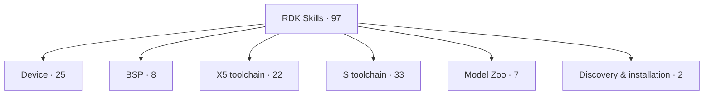
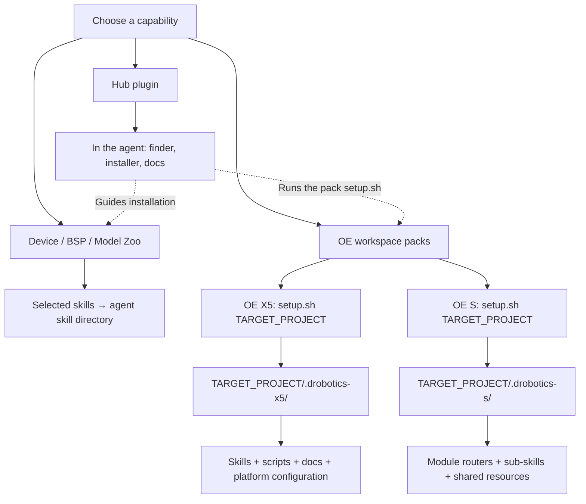

<!-- SPDX-License-Identifier: Apache-2.0 AND CC-BY-4.0 -->
<!-- Copyright (c) 2026 D-Robotics. All rights reserved. -->

# D-Robotics Agent Skills

[](#license)
[](https://agentskills.io)
[](https://github.com/D-Robotics/rdk-skills/actions/workflows/sync-skills.yml)

> English | [中文](README_cn.md)

Official Agent Skills catalog for D-Robotics RDK developer kits. Each skill is a portable instruction set that teaches AI coding agents (Claude Code, Codex, Cursor, etc.) how to diagnose boards, quantize and compile models, run inference pipelines, configure on-device systems, and deploy to RDK boards — grounded in official D-Robotics documentation, not model memory.

This repository is the **central catalog (Hub)**: each Skill Pack maintains its source in an independent product repo, and this repo mirrors, indexes, and serves as the single install entry point.

---

## Find the skill for your task

Choose a task area, then open its complete skill map. The catalog contains **97 skills**; OE toolchain skills require whole-pack setup.



[Device](docs/SKILL-MAP.md#device) · [BSP](docs/SKILL-MAP.md#bsp) · [X5 toolchain](docs/SKILL-MAP.md#x5) · [S toolchain](docs/SKILL-MAP.md#s) · [Model Zoo](docs/SKILL-MAP.md#zoo) · [Discovery & installation](docs/SKILL-MAP.md#hub)

## Installation layers: where does content go?

A pack groups related skills; its type determines how it is installed. The Hub plugin provides discovery and installation assistance. OE X5 and OE S each require setup in the target project.



| Your task | What to install | Next step |
|---|---|---|
| Discover capabilities | Hub plugin | Use the finder, then install the selected skill or pack |
| Device, BSP or Model Zoo tasks | Selected ordinary skills | Invoke in your agent; tasks may need additional SDKs or hardware |
| X5 model toolchain | Complete OE X5 pack | Run its `setup.sh` for your target project |
| S-series model toolchain | Complete OE S pack | Run its `setup.sh` for your target project |

**Installing the Hub plugin does not initialize an OE pack. Installing skills or packs does not install all SDKs, compilers or board runtimes.** See the installation options below and the [user guide](docs/SKILL-USAGE.md).

## Supported Boards

| Board | BPU Architecture | Compute |
|-------|------------------|---------|
| RDK X3 / X3 Module | Bernoulli | 5 TOPS |
| RDK X5 / X5 Module | Bayes-e | 10 TOPS |
| RDK Ultra | Bayes | 96 TOPS |
| RDK S100 / S100P | Nash-e / Nash-m | 80 / 128 TOPS |
| RDK S600 | Nash-p (4x Nash core) | up to 560 TOPS |

Board parameters follow official documentation repositories [rdk_x_doc](https://github.com/D-Robotics/rdk_x_doc) and [rdk_s_doc](https://github.com/D-Robotics/rdk_s_doc). Model format is `.bin` on X series and `.hbm` on S series.

---

## Installation

Choose what to install: [ordinary skills](#install-skills), [OE toolchain packs](#install-packs), or [agent plugins](#install-plugins). Each includes an AI prompt. Replace the bracketed fields first; ask your agent to guide any UI or credential steps.

<a id="install-skills"></a>

### 1. Ordinary skills: install what you need

For Device, BSP and Model Zoo capabilities. Skills go into the selected agent's skill directory.

**Copy to your AI:**

```text
Install ordinary skills from https://github.com/D-Robotics/rdk-skills for:
Task: [for example, troubleshoot an RDK X5 camera]
Target agent: [Claude Code / Codex / Cursor]
Scope: [current project and its absolute path, or global]

Read the repository instructions and skill index, identify the relevant skills,
and install them with the skills CLI for my chosen agent and scope.
Check the CLI's actual options; do not install every skill by default.
If the capability belongs to an OE workspace pack, use whole-pack setup instead.
Report skill names, actual installation paths, session reload requirements,
and one usage example. Guide me through any interactive steps you cannot perform.
```

**Manual installation:**

```bash
npx skills add d-robotics/rdk-skills --skill rdk-camera-setup
```

Select the agent and scope when prompted. Replace the example skill with your selection from the map.

The finder returns the command template `npx skills add d-robotics/rdk-skills --skill <skill-name>` for ordinary skills; substitute the selected skill name before running it.

For installation from a source repository, use this Device example prompt:

```text
Read the installation instructions at https://github.com/D-Robotics/rdk-device-skills
and install device skills for [target agent] in [installation scope].
Check the supported install.sh targets and options first.
Report the actual installation paths and verification results.
```

Manual entry point:

```bash
git clone https://github.com/D-Robotics/rdk-device-skills.git
cd rdk-device-skills
./install.sh --help
```

Other source repositories may provide different installers and options.

<a id="install-packs"></a>

### 2. OE toolchain packs: initialize each project

Choose the independent X5 or S pack for your target platform. Each contains shared skills, scripts and documentation that require whole-pack setup in the target project. These prompts do not require the Hub plugin; an agent with `rdk-pack-installer` can use it.

#### OE X5 pack

**Copy to your AI:**

```text
Install the complete OE X5 pack from https://github.com/D-Robotics/rdk-skills.
Target project: [absolute project path]
Target agent: [my agent]

Read the installation instructions and
skills/rdk-pack-installer/references/pack-registry.json.
Initialize the target project using skills/oe-skills-x5/setup.sh from the Hub.
Record a source ref matching the actual installed content.
If already installed, compare versions first. Before rebuilding an existing
directory, explain the impact on local edits and wait for my confirmation.
Verify .drobotics-x5/ using the registry verify_paths, check routing for my agent,
report any additional configuration, and give an X5 quantization example.
If Bash cannot run on this system, explain the required environment and next step.
```

**Result:** `project/.drobotics-x5/`, containing X5 skills, scripts, docs and platform configuration.

**Manual installation** (in Bash; replace the path with your project's absolute path):

```bash
git clone --depth 1 https://github.com/D-Robotics/rdk-skills.git
cd rdk-skills
bash skills/oe-skills-x5/setup.sh "/absolute/path/to/project"
```

#### OE S pack

**Copy to your AI:**

```text
Install the complete OE S pack from https://github.com/D-Robotics/rdk-skills.
Target project: [absolute project path]
Target agent: [my agent]

Read the installation instructions and
skills/rdk-pack-installer/references/pack-registry.json.
Initialize the target project using skills/oe-skills-s/setup.sh from the Hub.
Record a source ref matching the actual installed content.
If already installed, compare versions first. Before rebuilding an existing
directory, explain the impact on local edits and wait for my confirmation.
Verify .drobotics-s/ using the registry verify_paths, check routing for my agent,
report any additional configuration, and give an S-series compilation example.
If Bash cannot run on this system, explain the required environment and next step.
```

**Result:** `project/.drobotics-s/`, containing module routers, sub-skills and shared resources.

**Manual installation** (from the Hub checkout above):

```bash
bash skills/oe-skills-s/setup.sh "/absolute/path/to/project"
```

Skill/pack setup does not imply the OE SDK, compilers or board runtime are ready; prepare those for the task separately. Source pack repositories remain authoritative. If the Hub mirror is unavailable, consult the registry and source instructions to install the matching version.

<a id="install-plugins"></a>

### 3. Agent plugin entry points

#### Hub plugin: discovery and installation assistance

Provides the finder, installer and documentation helper. Install ordinary skills or initialize OE packs as needed afterwards.

**Copy to your AI:**

```text
Read the plugin instructions at https://github.com/D-Robotics/rdk-skills
and install the d-robotics-skills Hub plugin for [target agent].
Use that agent's supported plugin mechanism. If I must add a marketplace or
click Install, give me the exact steps; do not run Claude Code slash commands
as terminal commands.
Verify that rdk-skill-finder, rdk-pack-installer and the documentation helper
are available. Find capabilities for [my task] and explain what still needs
separate installation or project initialization.
```

**Manual entry point (inside Claude Code):**

```text
/plugin marketplace add D-Robotics/rdk-skills
```

Open `/plugin` → Discover and install `d-robotics-skills`. Other agents use their own supported plugin interfaces.

#### DSH plugin: DeepSeek Harness bundle

For DeepSeek Harness; content follows the bundle's release version.

**Copy to your AI:**

```text
Read the DSH plugin instructions at https://github.com/D-Robotics/rdk-skills
and install dsh-plugin-rdk for DeepSeek Harness profile [profile name].
Check the current dsh CLI options and plugin documentation, then verify that
the profile loads the plugin and its skills.
Report the package version, available capabilities and one usage example.
For OE toolchain tasks, separately check project pack initialization.
Guide any interactive steps that require my input.
```

**Manual installation:**

```bash
dsh plugin --profile <name> add dsh-plugin-rdk
dsh --profile <name>
```

### Updating installed content

**Copy to your AI:**

```text
Check and update my RDK skills, Hub plugin or OE packs for [agent / DSH profile]
in [absolute project path or global scope] through their installation channels.
Report installed and target versions first. For OE packs, compare the registry
ref against INSTALLED_REF (falling back to VERSION).
Before rebuilding .drobotics-x5/ or .drobotics-s/, explain the impact on local edits
and wait for my confirmation. Verify and report the result afterwards.
```

Update ordinary skills through the skills CLI, the Hub plugin through your agent's plugin manager, and DSH through its plugin update command. For OE packs, obtain the target resources and run the appropriate `setup.sh --update`; any recorded `--ref` must match those resources.

Hub content advances through source-Release upgrade PRs after merge. Installed user copies still require an update through their own channels.

---

## Skill Catalog

Explore the [complete skill map](docs/SKILL-MAP.md). Install Device, BSP and Model Zoo as [ordinary skills](#install-skills); initialize OE X5/S using [whole-pack setup](#install-packs).

<!-- skills-table-start -->
| Product | Description | Skills |
|---------|-------------|--------|
| **BSP Skills** | Board Support Package (BSP) development skills for RDK boards — host cross-compilation environment, repo/manifest source sync, system image build, kernel/DTB/driver modules, hobot-* deb packages, bootloader/miniboot, Ubuntu rootfs customization for X3/X5, and S-series source acquisition. | [ `bsp-env-setup`](skills/bsp-env-setup), [ `bsp-source-sync`](skills/bsp-source-sync), [ `bsp-image-build`](skills/bsp-image-build), [ `bsp-kernel-build`](skills/bsp-kernel-build), [ `bsp-deb-build`](skills/bsp-deb-build), [ `bsp-bootloader-build`](skills/bsp-bootloader-build), [ `bsp-rootfs-custom`](skills/bsp-rootfs-custom), [ `bsp-s-series`](skills/bsp-s-series) |
| **OE Tool Chain (S)** | D Robotics OpenExplorer (OE) tool chain for S-series — PTQ/QAT quantization, HBDK compilation, UCP on-board inference, performance and accuracy evaluation, and LLM compression. Workspace-integrated pack requiring setup.sh initialization. | [ `drobotics-router`](skills/oe-skills-s/skills/drobotics-router), [ `board-detection`](skills/oe-skills-s/skills/drobotics-router/board-detection), [ `oe-llm-package-detection`](skills/oe-skills-s/skills/drobotics-router/oe-llm-package-detection), [ `oe-llm-package-install`](skills/oe-skills-s/skills/drobotics-router/oe-llm-package-install), [ `oe-package-detection`](skills/oe-skills-s/skills/drobotics-router/oe-package-detection), [ `oe-package-install`](skills/oe-skills-s/skills/drobotics-router/oe-package-install), [ `hbdk-manual`](skills/oe-skills-s/skills/hbdk/hbdk-manual), [ `s-hbdk-compile`](skills/oe-skills-s/skills/hbdk/s-hbdk-compile), [ `hmct`](skills/oe-skills-s/skills/hmct), [ `s-hmct-cosine-similarity-tuning`](skills/oe-skills-s/skills/hmct/s-hmct-cosine-similarity-tuning), [ `s-plugin-adaptation`](skills/oe-skills-s/skills/plugin/s-plugin-adaptation), [ `s-plugin-dynamic-block`](skills/oe-skills-s/skills/plugin/s-plugin-adaptation/s-plugin-dynamic-block), [ `s-plugin-insert-quant-dequant`](skills/oe-skills-s/skills/plugin/s-plugin-adaptation/s-plugin-insert-quant-dequant), [ `s-plugin-prepare`](skills/oe-skills-s/skills/plugin/s-plugin-adaptation/s-plugin-prepare), [ `s-plugin-set-fake-quantize`](skills/oe-skills-s/skills/plugin/s-plugin-adaptation/s-plugin-set-fake-quantize), [ `s-plugin-set-march`](skills/oe-skills-s/skills/plugin/s-plugin-adaptation/s-plugin-set-march), [ `s-plugin-consistency-debug`](skills/oe-skills-s/skills/plugin/s-plugin-consistency-debug), [ `s-plugin-export`](skills/oe-skills-s/skills/plugin/s-plugin-export), [ `s-plugin-graph-diff`](skills/oe-skills-s/skills/plugin/s-plugin-graph-diff), [ `s-plugin-hbdk-generating`](skills/oe-skills-s/skills/plugin/s-plugin-hbdk-generating), [ `s-hbdk-export-compile`](skills/oe-skills-s/skills/plugin/s-plugin-hbdk-generating/s-hbdk-export-compile), [ `s-plugin-quantization`](skills/oe-skills-s/skills/plugin/s-plugin-hbdk-generating/s-plugin-quantization), [ `s-plugin-model-check-result`](skills/oe-skills-s/skills/plugin/s-plugin-model-check-result), [ `s-plugin-precision-tuning`](skills/oe-skills-s/skills/plugin/s-plugin-precision-tuning), [ `hb-analyzer-performance`](skills/oe-skills-s/skills/tc_ui/hb-analyzer-performance), [ `s-tc-ui`](skills/oe-skills-s/skills/tc_ui/s-tc-ui), [ `ucp`](skills/oe-skills-s/skills/ucp), [ `s-board-monitor`](skills/oe-skills-s/skills/ucp/s-board-monitor), [ `s-ucp-hbm-infer`](skills/oe-skills-s/skills/ucp/s-ucp-hbm-infer), [ `s-ucp-infer-generating`](skills/oe-skills-s/skills/ucp/s-ucp-infer-generating), [ `s-ucp-model-perf-eval`](skills/oe-skills-s/skills/ucp/s-ucp-model-perf-eval), [ `s-ucp-perfetto-trace-analysis`](skills/oe-skills-s/skills/ucp/s-ucp-perfetto-trace-analysis), [ `s-ucp-perfetto-trace-catcher`](skills/oe-skills-s/skills/ucp/s-ucp-perfetto-trace-catcher) |
| **OE Tool Chain (X5)** | OpenExplorer X5 tool chain — model quantization (PTQ/QAT), compilation, inference, performance evaluation, and diagnostics. Workspace-integrated pack requiring setup.sh initialization. | [ `x5-accuracy-diagnostics`](skills/oe-skills-x5/skills/x5-accuracy-diagnostics), [ `x5-board-monitor`](skills/oe-skills-x5/skills/x5-board-monitor), [ `x5-bpu-python-api`](skills/oe-skills-x5/skills/x5-bpu-python-api), [ `x5-calibration-data-prepare`](skills/oe-skills-x5/skills/x5-calibration-data-prepare), [ `x5-consistency-diagnostics`](skills/oe-skills-x5/skills/x5-consistency-diagnostics), [ `x5-environment-install`](skills/oe-skills-x5/skills/x5-environment-install), [ `x5-environment-probe`](skills/oe-skills-x5/skills/x5-environment-probe), [ `x5-environment-setup`](skills/oe-skills-x5/skills/x5-environment-setup), [ `x5-model-diagnostics`](skills/oe-skills-x5/skills/x5-model-diagnostics), [ `x5-model-preflight`](skills/oe-skills-x5/skills/x5-model-preflight), [ `x5-performance-diagnostics`](skills/oe-skills-x5/skills/x5-performance-diagnostics), [ `x5-ptq-compile`](skills/oe-skills-x5/skills/x5-ptq-compile), [ `x5-ptq-config-authoring`](skills/oe-skills-x5/skills/x5-ptq-config-authoring), [ `x5-ptq-deploy`](skills/oe-skills-x5/skills/x5-ptq-deploy), [ `x5-qat-adaptation`](skills/oe-skills-x5/skills/x5-qat-adaptation), [ `x5-qat-compile`](skills/oe-skills-x5/skills/x5-qat-compile), [ `x5-qat-deploy`](skills/oe-skills-x5/skills/x5-qat-deploy), [ `x5-qat-training`](skills/oe-skills-x5/skills/x5-qat-training), [ `x5-router`](skills/oe-skills-x5/skills/x5-router), [ `x5-runtime-cpp-infer`](skills/oe-skills-x5/skills/x5-runtime-cpp-infer), [ `x5-runtime-deploy`](skills/oe-skills-x5/skills/x5-runtime-deploy), [ `x5-runtime-perf-eval`](skills/oe-skills-x5/skills/x5-runtime-perf-eval) |
| **RDK Device Skills** | Device-side skills for RDK boards — diagnostics, memory audit, headless mode, camera, vision pipeline, model deploy & benchmarking, GPIO, TROS, doc search, hardware specs, board selection, peripherals, accessories, LLM/VLM deployment, embodied AI, S-series delegate, command manual, source map. | [ `rdk-diagnostic`](skills/rdk-diagnostic), [ `rdk-memory-audit`](skills/rdk-memory-audit), [ `rdk-headless-mode`](skills/rdk-headless-mode), [ `rdk-camera-setup`](skills/rdk-camera-setup), [ `rdk-vision-pipeline`](skills/rdk-vision-pipeline), [ `rdk-model-deploy`](skills/rdk-model-deploy), [ `rdk-model-benchmark`](skills/rdk-model-benchmark), [ `rdk-docs-reference`](skills/rdk-docs-reference), [ `rdk-system-config`](skills/rdk-system-config), [ `rdk-network-remote`](skills/rdk-network-remote), [ `rdk-system-maintain`](skills/rdk-system-maintain), [ `rdk-log-forensics`](skills/rdk-log-forensics), [ `rdk-gpio-40pin`](skills/rdk-gpio-40pin), [ `rdk-tros-setup`](skills/rdk-tros-setup), [ `rdk-ecosystem`](skills/rdk-ecosystem), [ `rdk-hardware`](skills/rdk-hardware), [ `rdk-board-knowledge`](skills/rdk-board-knowledge), [ `rdk-multimedia`](skills/rdk-multimedia), [ `rdk-peripheral-cookbook`](skills/rdk-peripheral-cookbook), [ `rdk-accessories`](skills/rdk-accessories), [ `rdk-llm-deployment`](skills/rdk-llm-deployment), [ `rdk-embodied-lerobot`](skills/rdk-embodied-lerobot), [ `rdk-board-delegate`](skills/rdk-board-delegate), [ `rdk-command-manual`](skills/rdk-command-manual), [ `rdk-source-map`](skills/rdk-source-map) |
| **RDK Model Zoo Skills** | Cross-platform Model Zoo discovery, repository context, integration, development, validation, review and release workflows for X5, S series, X3 and historical layouts. | [ `rdk-model-zoo`](skills/rdk-model-zoo), [ `rdk-model-zoo-develop`](skills/rdk-model-zoo-develop), [ `rdk-model-zoo-integrate`](skills/rdk-model-zoo-integrate), [ `rdk-model-zoo-release`](skills/rdk-model-zoo-release), [ `rdk-model-zoo-repo`](skills/rdk-model-zoo-repo), [ `rdk-model-zoo-review`](skills/rdk-model-zoo-review), [ `rdk-model-zoo-validate`](skills/rdk-model-zoo-validate) |
<!-- skills-table-end -->

---

## Feedback and Contributing

**Issue routing:**

- **Skill content issues** (a skill has a bug or missing feature) — file in the source repo for that product, see table below
- **Catalog repo issues** (README errors, sync pipeline failures, distribution channels) — [open an issue here](https://github.com/D-Robotics/rdk-skills/issues/new/choose)
- **Questions, ideas and shared workflows** — [browse Discussions](https://github.com/D-Robotics/rdk-skills/discussions) or [start a discussion](https://github.com/D-Robotics/rdk-skills/discussions/new/choose). Choose the category that matches your topic; Announcements is for maintainer updates.
- **Security vulnerabilities** — follow the disclosure process in [SECURITY.md](SECURITY.md); do not open a public issue

When asking for help, include your board model, operating system, AI agent, skill or pack name, and relevant error messages. Remove credentials and sensitive information. Use Issues for reproducible bugs.

**Guides:**

- End-user install & usage — [docs/SKILL-USAGE.md](docs/SKILL-USAGE.md)
- Registering a new pack / PR rules — [docs/PR-SUBMISSION.md](docs/PR-SUBMISSION.md) and [CONTRIBUTING.md](CONTRIBUTING.md)

Product source repos:

<!-- help-table-start -->
| Product | Issues | Discussions | Contributing |
|---------|--------|-------------|--------------|
| **BSP Skills** | [Issues](https://github.com/D-Robotics/bsp-skills/issues) | — | [Contributing](https://github.com/D-Robotics/bsp-skills/blob/main/CONTRIBUTING.md) |
| **OE Tool Chain (S)** | [Issues](https://github.com/D-Robotics/oe-skills-s/issues) | — | — |
| **OE Tool Chain (X5)** | [Issues](https://github.com/D-Robotics/oe-skills-x5/issues) | — | [Contributing](https://github.com/D-Robotics/oe-skills-x5/blob/main/CONTRIBUTING.md) |
| **RDK Device Skills** | [Issues](https://github.com/D-Robotics/rdk-device-skills/issues) | [Discussions](https://github.com/D-Robotics/rdk-device-skills/discussions) | [Contributing](https://github.com/D-Robotics/rdk-device-skills/blob/main/CONTRIBUTING.md) |
| **RDK Model Zoo Skills** | [Issues](https://github.com/D-Robotics/rdk_model_zoo/issues) | — | [Contributing](https://github.com/D-Robotics/rdk_model_zoo/blob/main/docs/Model_Zoo_Repository_Guidelines.md) |
<!-- help-table-end -->

---

## Skill Structure

Each skill is a self-contained directory:

```
skills/<skill-name>/
├── SKILL.md          # entry point: YAML frontmatter + agent instructions
├── skill-card.md     # governance card: owner, license, use case, known risks
├── scripts/          # helper scripts (bash), read-only by default, --apply for writes
├── references/       # reference material with documentation provenance
└── evals/            # evaluation task definitions (5 dimensions: security/correctness/discoverability/effectiveness/efficiency)
```

Follows the [Agent Skills specification](https://agentskills.io/specification):
- Each skill is a directory with a `SKILL.md` at its root
- YAML frontmatter with required `name` and `description` fields
- Progressive disclosure: lightweight metadata loads at startup, full instructions load on activation

---

## Repository Structure

```
D-Robotics/rdk-skills/
├── skills/                      # mirror directory (written by sync pipeline, read-only)
│   ├── README.md                 # install guidance
│   ├── rdk-pack-installer/        # hub-native installer skill (catalog exception)
│   ├── <skill-name>/             # flat-layout skills (RDK Device Skills)
│   ├── oe-skills-x5/             # workspace pack mirror (full x5/ resource tree + setup.sh, self-installable)
│   └── oe-skills-s/              # workspace pack mirror (full drobotics-s/ resource tree + setup.sh, self-installable)
├── components.d/                # Pack registry (one YAML per product)
│   ├── README.md                 # registration schema
│   ├── rdk-device.yml
│   ├── oe-tool-chain-x5.yml
│   └── oe-tool-chain-s.yml
├── plugins.d/                   # plugin build configuration
│   ├── README.md
│   ├── _defaults.yml
│   └── d-robotics-skills.yml
├── plugins/                     # built plugin distributions
├── .claude-plugin/              # Claude Code marketplace
├── .agents/plugins/             # Codex marketplace
├── .cursor-plugin/              # Cursor marketplace
├── .dsh-plugin/                 # DeepSeek Harness (DSH) bundle marketplace
├── docs/                        # PR submission rules + skill usage guide
├── .github/
│   ├── workflows/                # sync pipeline, DCO check
│   └── scripts/                  # sync, validate, regenerate-readme, prune-orphans
├── skills.sh.json               # Skills.sh grouping config
├── catalog-exceptions.yml       # skills/ dirs allowed without registration
├── CHANGELOG.md
├── CONTRIBUTING.md
├── SECURITY.md
├── CODE_OF_CONDUCT.md
├── LICENSE-APACHE               # source code license
└── LICENSE-CC-BY-4.0            # documentation/skills license
```

---

## License

Per ADR 0004, this repository uses a dual license by file type.
License mapping: code and scripts = Apache-2.0; SKILL.md, skill-card.md, references, and other documentation content = CC-BY-4.0.
Code and scripts are licensed under [Apache-2.0](LICENSE-APACHE), while `SKILL.md`,
`skill-card.md`, `references`, and other documentation content are licensed under
[CC-BY-4.0](LICENSE-CC-BY-4.0). For compatibility with the current Skill
ecosystem, top-level Skill frontmatter continues to use `license: Apache-2.0`.
New or substantively modified Skills are recommended to declare
`metadata.content-license: CC-BY-4.0` as well. This is a clarification of future
contribution rules; it does not retroactively relicense existing content.
