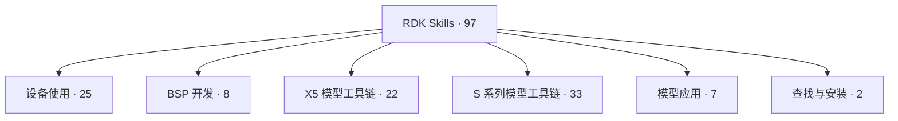
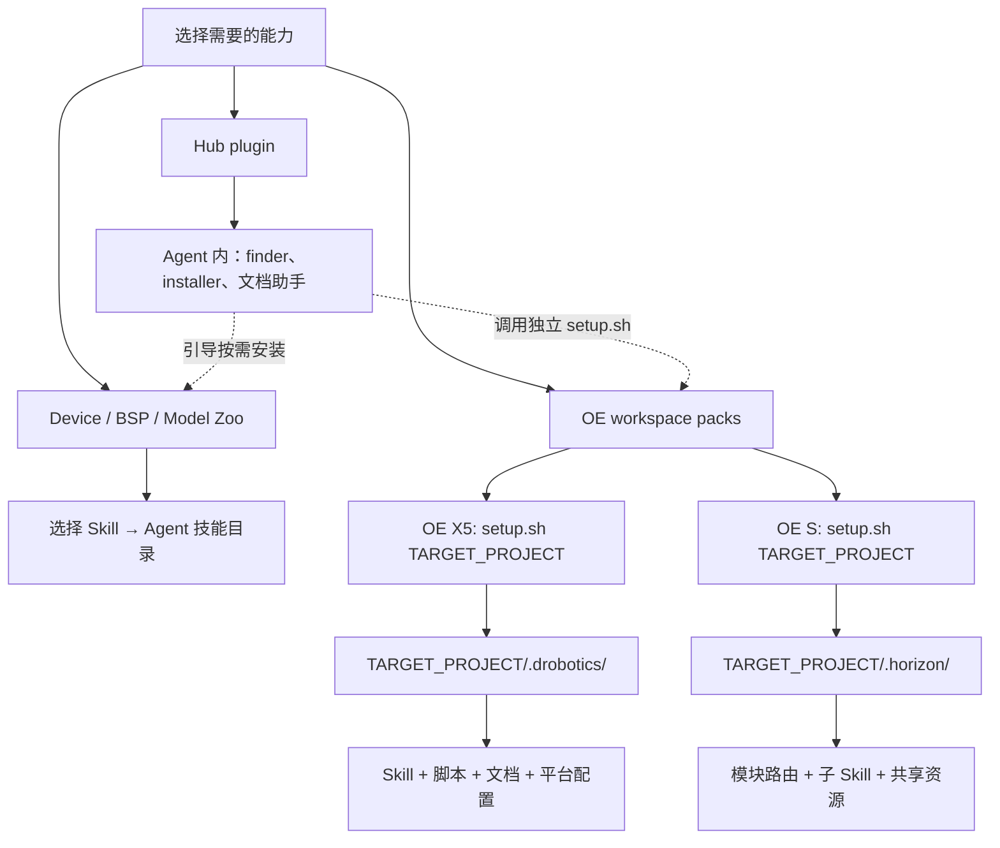

<!-- SPDX-License-Identifier: Apache-2.0 AND CC-BY-4.0 -->
<!-- Copyright (c) 2026 D-Robotics. All rights reserved. -->

# D-Robotics Agent Skills

[](#许可证)
[](https://agentskills.io)
[](https://github.com/D-Robotics/rdk-skills/actions/workflows/sync-skills.yml)

> 中文 | [English](README.md)

面向 D-Robotics RDK 开发者套件的官方 Agent Skills 目录。每个 Skill 是一组可移植的指令文件，让 AI 编程助手（Claude Code、Codex、Cursor 等）能够诊断板卡、量化编译模型、跑通推理流水线、配置板端系统、部署到 RDK 板卡——所有能力都基于 D-Robotics 官方文档，而非模型记忆。

本仓库是**中央目录（Hub）**：各 Skill Pack 在独立的产品仓库中维护源头，本仓库负责镜像同步、统一索引和安装入口。用户只需跟这一个仓库打交道。

---

## 找到你需要的 Skill

先选任务领域，再点击进入完整技能图。当前目录共 **97 个 Skill**；OE 工具链内部技能需要整包安装。



[设备使用](docs/SKILL-MAP.md#device) · [BSP 开发](docs/SKILL-MAP.md#bsp) · [X5 模型工具链](docs/SKILL-MAP.md#x5) · [S 系列模型工具链](docs/SKILL-MAP.md#s) · [模型应用](docs/SKILL-MAP.md#zoo) · [查找与安装](docs/SKILL-MAP.md#hub)

## 安装层级：内容装到哪里？

Pack 是技能的组织单位，安装方式取决于 Pack 类型。Hub 插件提供导航和安装助手；OE X5 与 OE S 需要分别在目标项目中初始化。



| 你要做什么 | 安装内容 | 后续操作 |
|---|---|---|
| 先查找合适的能力 | Hub 插件 | 通过 finder 查找；按结果安装 Skill 或 Pack |
| 使用设备、BSP、Model Zoo 技能 | 按需选择普通 Skill | 在 Agent 中调用；任务可能另需 SDK 或设备环境 |
| 使用 X5 模型工具链 | 完整 OE X5 Pack | 在目标项目执行 X5 的 `setup.sh` |
| 使用 S 系列模型工具链 | 完整 OE S Pack | 在目标项目执行 S 的 `setup.sh` |

**Hub 插件安装成功不代表 OE Pack 已初始化。Skill/Pack 安装也不包含全部 SDK、编译工具链或板端运行环境。** 下面的安装章节保留具体入口；完整说明见 [用户指南](docs/SKILL-USAGE.md)。

## 支持的板卡

| 板卡 | BPU 架构 | 算力 |
|------|----------|------|
| RDK X3 / X3 Module | Bernoulli | 5 TOPS |
| RDK X5 / X5 Module | Bayes-e | 10 TOPS |
| RDK Ultra | Bayes | 96 TOPS |
| RDK S100 / S100P | Nash-e / Nash-m | 80 / 128 TOPS |
| RDK S600 | Nash-p（4× Nash core） | 560 TOPS |

板卡参数取自官方文档仓库 [rdk_x_doc](https://github.com/D-Robotics/rdk_x_doc) 和 [rdk_s_doc](https://github.com/D-Robotics/rdk_s_doc)。X 系列模型格式为 `.bin`，S 系列为 `.hbm`。

---

## 安装

先选择安装对象：[普通 Skill](#install-skills)、[OE 工具链 Pack](#install-packs) 或 [Agent 插件](#install-plugins)。每类都提供 AI Prompt；请先替换其中的方括号内容。需要点击菜单或输入凭据的步骤，由 AI 告诉你如何完成。

<a id="install-skills"></a>

### 1. 普通 Skill：按需安装

适用于 Device、BSP、Model Zoo。安装到你选择的 Agent 技能目录。

**复制给 AI：**

```text
请从 https://github.com/D-Robotics/rdk-skills 为我安装适合以下任务的普通 Skill：
任务：[例如排查 RDK X5 摄像头问题]
目标 Agent：[例如 Claude Code / Codex / Cursor]
安装范围：[当前项目及其绝对路径，或全局]

先读取仓库说明和 Skill 索引，找到对应 Skill，再通过 skills CLI 安装到指定 Agent
和范围。检查 CLI 的实际选项，不要默认安装全部 Skill。
如果选中的能力属于 OE workspace Pack，请转到整包初始化流程。
安装后报告 Skill 名称、实际安装路径、是否需要重新加载会话，并给出一个使用示例。
需要我完成交互步骤时，请提供具体操作。
```

**手动安装：**

```bash
npx skills add d-robotics/rdk-skills --skill rdk-camera-setup
```

按 CLI 提示选择 Agent 和安装范围；将示例 Skill 名称替换为导航图中的目标名称。

Finder 对普通 Skill 返回命令模板 `npx skills add d-robotics/rdk-skills --skill <skill-name>`；执行前请替换为所选 Skill 名称。

也可从源仓库安装。以 Device 为例，复制给 AI：

```text
请读取 https://github.com/D-Robotics/rdk-device-skills 的安装说明，
为 [目标 Agent] 安装设备侧 Skill。先核对 install.sh 支持的安装范围、
目标和参数，再按 [我的安装范围] 执行，并报告实际安装目录及验证结果。
```

手动入口：

```bash
git clone https://github.com/D-Robotics/rdk-device-skills.git
cd rdk-device-skills
./install.sh --help
```

其他源仓库的安装脚本和参数以各自文档为准。

<a id="install-packs"></a>

### 2. OE 工具链 Pack：按项目整包安装

X5 和 S 是两套独立 Pack，按目标平台选择。它们包含相互依赖的 Skill、脚本和文档，需要在目标项目初始化完整资源树。安装 Hub 插件不是执行以下 Prompt 的前提；如果已有 `rdk-pack-installer`，AI 可以使用它。

#### OE X5 Pack

**复制给 AI：**

```text
请从 https://github.com/D-Robotics/rdk-skills 安装完整 OE X5 Pack。
目标项目：[项目绝对路径]
目标 Agent：[我使用的 Agent]

读取仓库安装说明和 skills/rdk-pack-installer/references/pack-registry.json。
使用 Hub 中 skills/oe-skills-x5/setup.sh 初始化目标项目；记录与安装内容一致的来源 ref。
如果已安装，先比较版本并报告；需要重建目录时，说明本地修改的影响并等我确认。
完成后按注册表 verify_paths 验证 .drobotics/，检查目标 Agent 的路由接入，
说明是否需要额外配置，并给出一个 X5 模型量化任务示例。
如果当前系统无法执行 Bash，请说明适用环境和下一步操作。
```

**安装结果：** `项目/.drobotics/`，包含 X5 Skill、脚本、文档和平台配置。

**手动安装**（在 Bash 环境中，将路径替换为真实项目绝对路径）：

```bash
git clone --depth 1 https://github.com/D-Robotics/rdk-skills.git
cd rdk-skills
bash skills/oe-skills-x5/setup.sh "/absolute/path/to/project"
```

#### OE S Pack

**复制给 AI：**

```text
请从 https://github.com/D-Robotics/rdk-skills 安装完整 OE S Pack。
目标项目：[项目绝对路径]
目标 Agent：[我使用的 Agent]

读取仓库安装说明和 skills/rdk-pack-installer/references/pack-registry.json。
使用 Hub 中 skills/oe-skills-s/setup.sh 初始化目标项目；记录与安装内容一致的来源 ref。
如果已安装，先比较版本并报告；需要重建目录时，说明本地修改的影响并等我确认。
完成后按注册表 verify_paths 验证 .horizon/，检查目标 Agent 的路由接入，
说明是否需要额外配置，并给出一个 S 系列模型编译任务示例。
如果当前系统无法执行 Bash，请说明适用环境和下一步操作。
```

**安装结果：** `项目/.horizon/`，包含模块路由、子 Skill 和共享资源。

**手动安装**（在上述 Hub checkout 中执行）：

```bash
bash skills/oe-skills-s/setup.sh "/absolute/path/to/project"
```

Skill/Pack 初始化不代表 OE SDK、编译工具链或板端运行环境已经就绪；根据后续任务另行准备。源 Pack 仓库是权威上游，Hub 镜像不可用时按注册表和源仓库说明选择对应版本安装。

<a id="install-plugins"></a>

### 3. Agent 插件入口

#### Hub 插件：查找与安装助手

适合希望让 AI 帮忙选择 Skill 的用户。安装后可使用 finder、installer 和文档助手；普通 Skill 与 OE Pack 再按任务安装。

**复制给 AI：**

```text
请读取 https://github.com/D-Robotics/rdk-skills 的插件安装说明，
为 [目标 Agent] 安装 d-robotics-skills Hub 插件。
使用该 Agent 实际支持的插件机制；如需我在界面添加市场或点击安装，
请给出具体操作，不要把 Claude Code 的斜杠命令当成终端命令。
完成后核对 rdk-skill-finder、rdk-pack-installer 和文档助手是否可用。
先帮我查找 [目标任务] 所需的能力，并说明哪些还需单独安装或初始化。
```

**手动入口（Claude Code 内执行）：**

```text
/plugin marketplace add D-Robotics/rdk-skills
```

再打开 `/plugin` → Discover，安装 `d-robotics-skills`。其他 Agent 使用各自支持的插件入口。

#### DSH 插件：DeepSeek Harness 分发包

适用于 DeepSeek Harness，内容随 DSH 分发包版本更新。

**复制给 AI：**

```text
请读取 https://github.com/D-Robotics/rdk-skills 的 DSH 插件说明，
为 DeepSeek Harness 的 [profile 名称] 安装 dsh-plugin-rdk。
核对当前 dsh CLI 的参数和插件说明，安装后验证该 profile 能加载插件及其技能。
报告包版本、可用能力和一个使用示例。
如果我要使用 OE 工具链，请另行检查项目 Pack 是否已初始化。
需要我完成交互步骤时，请提供具体操作。
```

**手动安装：**

```bash
dsh plugin --profile <name> add dsh-plugin-rdk
dsh --profile <name>
```

### 更新已安装的内容

**复制给 AI：**

```text
请检查我在 [目标 Agent / DSH profile]、[项目绝对路径或全局范围]
安装的 RDK Skill、Hub 插件或 OE Pack，并按各自的安装渠道更新。
先报告当前版本和目标版本。OE Pack 依据注册表 ref 与项目 INSTALLED_REF
（缺失时参考 VERSION）比较；重建 .drobotics/ 或 .horizon/ 前，
说明本地修改会受到的影响并等我确认。完成后验证并报告更新结果。
```

普通 Skill 使用 skills CLI 更新，Hub 插件通过 Agent 插件管理器更新，DSH 使用其插件更新命令。OE Pack 更新需获取目标版本资源，再运行相应 `setup.sh --update`；记录 `--ref` 时必须与实际资源版本一致。

Hub 内容通过来源 Release 触发的升级 PR 更新，合入后才进入主分支；用户已安装的副本仍需按上述渠道更新。

---

## Skill 目录

完整技能关系见[全量导航图](docs/SKILL-MAP.md)。Device、BSP、Model Zoo 按[普通 Skill](#install-skills)安装；OE X5/S 内部技能按[整包初始化](#install-packs)安装。

<!-- skills-table-start -->
| 产品 | 说明 | Skills |
|------|------|--------|
| **BSP Skills** | 板级支持包（BSP）开发技能——主机交叉编译环境、repo/manifest 源码同步、系统镜像构建、内核/设备树/驱动模块、hobot-* deb 包、bootloader/miniboot、X3/X5 Ubuntu 根文件系统定制，以及 S 系列源码获取。 | [ `bsp-env-setup`](skills/bsp-env-setup), [ `bsp-source-sync`](skills/bsp-source-sync), [ `bsp-image-build`](skills/bsp-image-build), [ `bsp-kernel-build`](skills/bsp-kernel-build), [ `bsp-deb-build`](skills/bsp-deb-build), [ `bsp-bootloader-build`](skills/bsp-bootloader-build), [ `bsp-rootfs-custom`](skills/bsp-rootfs-custom), [ `bsp-s-series`](skills/bsp-s-series) |
| **RDK Device Skills** | 设备侧技能：诊断快照、内存审计、无头模式、摄像头、视觉流水线、模型部署与基准测试、GPIO、TROS、文档检索、硬件规格、板卡选型、Model Zoo、外设驱动、官方配件、端侧 LLM/VLM 部署、具身智能、S 系列异构开发、命令手册、源码导航 | [ `rdk-diagnostic`](skills/rdk-diagnostic), [ `rdk-memory-audit`](skills/rdk-memory-audit), [ `rdk-headless-mode`](skills/rdk-headless-mode), [ `rdk-camera-setup`](skills/rdk-camera-setup), [ `rdk-vision-pipeline`](skills/rdk-vision-pipeline), [ `rdk-model-deploy`](skills/rdk-model-deploy), [ `rdk-model-benchmark`](skills/rdk-model-benchmark), [ `rdk-docs-reference`](skills/rdk-docs-reference), [ `rdk-system-config`](skills/rdk-system-config), [ `rdk-network-remote`](skills/rdk-network-remote), [ `rdk-system-maintain`](skills/rdk-system-maintain), [ `rdk-log-forensics`](skills/rdk-log-forensics), [ `rdk-gpio-40pin`](skills/rdk-gpio-40pin), [ `rdk-tros-setup`](skills/rdk-tros-setup), [ `rdk-ecosystem`](skills/rdk-ecosystem), [ `rdk-hardware`](skills/rdk-hardware), [ `rdk-board-knowledge`](skills/rdk-board-knowledge), [ `rdk-model-zoo`](skills/rdk-model-zoo), [ `rdk-multimedia`](skills/rdk-multimedia), [ `rdk-peripheral-cookbook`](skills/rdk-peripheral-cookbook), [ `rdk-accessories`](skills/rdk-accessories), [ `rdk-llm-deployment`](skills/rdk-llm-deployment), [ `rdk-embodied-lerobot`](skills/rdk-embodied-lerobot), [ `rdk-board-delegate`](skills/rdk-board-delegate), [ `rdk-command-manual`](skills/rdk-command-manual), [ `rdk-source-map`](skills/rdk-source-map) |
| **OE 工具链 (X5)** | OpenExplorer X5 工具链——模型量化（PTQ/QAT）、编译、推理、性能评测、诊断。Workspace 集成型 Pack，需 setup.sh 初始化。 | [ `x5-accuracy-diagnostics`](skills/oe-skills-x5/skills/x5-accuracy-diagnostics), [ `x5-board-monitor`](skills/oe-skills-x5/skills/x5-board-monitor), [ `x5-bpu-python-api`](skills/oe-skills-x5/skills/x5-bpu-python-api), [ `x5-calibration-data-prepare`](skills/oe-skills-x5/skills/x5-calibration-data-prepare), [ `x5-consistency-diagnostics`](skills/oe-skills-x5/skills/x5-consistency-diagnostics), [ `x5-environment-install`](skills/oe-skills-x5/skills/x5-environment-install), [ `x5-environment-probe`](skills/oe-skills-x5/skills/x5-environment-probe), [ `x5-environment-setup`](skills/oe-skills-x5/skills/x5-environment-setup), [ `x5-model-diagnostics`](skills/oe-skills-x5/skills/x5-model-diagnostics), [ `x5-model-preflight`](skills/oe-skills-x5/skills/x5-model-preflight), [ `x5-performance-diagnostics`](skills/oe-skills-x5/skills/x5-performance-diagnostics), [ `x5-ptq-compile`](skills/oe-skills-x5/skills/x5-ptq-compile), [ `x5-ptq-config-authoring`](skills/oe-skills-x5/skills/x5-ptq-config-authoring), [ `x5-ptq-deploy`](skills/oe-skills-x5/skills/x5-ptq-deploy), [ `x5-qat-adaptation`](skills/oe-skills-x5/skills/x5-qat-adaptation), [ `x5-qat-compile`](skills/oe-skills-x5/skills/x5-qat-compile), [ `x5-qat-deploy`](skills/oe-skills-x5/skills/x5-qat-deploy), [ `x5-qat-training`](skills/oe-skills-x5/skills/x5-qat-training), [ `x5-router`](skills/oe-skills-x5/skills/x5-router), [ `x5-runtime-cpp-infer`](skills/oe-skills-x5/skills/x5-runtime-cpp-infer), [ `x5-runtime-deploy`](skills/oe-skills-x5/skills/x5-runtime-deploy), [ `x5-runtime-perf-eval`](skills/oe-skills-x5/skills/x5-runtime-perf-eval) |
| **OE 工具链 (S)** | Horizon OpenExplorer（OE）工具链，面向 S 系列——PTQ/QAT 量化、HBDK 编译、UCP 板端推理、性能与精度评估、LLM 压缩。Workspace 集成型 Pack，需 setup.sh 初始化。 | [ `hbdk-manual`](skills/oe-skills-s/skills/hbdk/hbdk-manual), [ `j6-hbdk-compile`](skills/oe-skills-s/skills/hbdk/j6-hbdk-compile), [ `j6-hmct-cosine-similarity-tuning`](skills/oe-skills-s/skills/hmct/j6-hmct-cosine-similarity-tuning), [ `hmct`](skills/oe-skills-s/skills/hmct), [ `hb-analyzer-performance`](skills/oe-skills-s/skills/horizon_tc_ui/hb-analyzer-performance), [ `horizon-tc-ui`](skills/oe-skills-s/skills/horizon_tc_ui/horizon-tc-ui), [ `board-detection`](skills/oe-skills-s/skills/horizon-router/board-detection), [ `oe-llm-package-detection`](skills/oe-skills-s/skills/horizon-router/oe-llm-package-detection), [ `oe-llm-package-install`](skills/oe-skills-s/skills/horizon-router/oe-llm-package-install), [ `oe-package-detection`](skills/oe-skills-s/skills/horizon-router/oe-package-detection), [ `oe-package-install`](skills/oe-skills-s/skills/horizon-router/oe-package-install), [ `horizon-router`](skills/oe-skills-s/skills/horizon-router), [ `j6-plugin-dynamic-block`](skills/oe-skills-s/skills/plugin/j6-plugin-adaptation/j6-plugin-dynamic-block), [ `j6-plugin-insert-quant-dequant`](skills/oe-skills-s/skills/plugin/j6-plugin-adaptation/j6-plugin-insert-quant-dequant), [ `j6-plugin-prepare`](skills/oe-skills-s/skills/plugin/j6-plugin-adaptation/j6-plugin-prepare), [ `j6-plugin-set-fake-quantize`](skills/oe-skills-s/skills/plugin/j6-plugin-adaptation/j6-plugin-set-fake-quantize), [ `j6-plugin-set-march`](skills/oe-skills-s/skills/plugin/j6-plugin-adaptation/j6-plugin-set-march), [ `j6-plugin-adaptation`](skills/oe-skills-s/skills/plugin/j6-plugin-adaptation), [ `j6-plugin-consistency-debug`](skills/oe-skills-s/skills/plugin/j6-plugin-consistency-debug), [ `j6-plugin-export`](skills/oe-skills-s/skills/plugin/j6-plugin-export), [ `j6-plugin-graph-diff`](skills/oe-skills-s/skills/plugin/j6-plugin-graph-diff), [ `j6-hbdk-export-compile`](skills/oe-skills-s/skills/plugin/j6-plugin-hbdk-generating/j6-hbdk-export-compile), [ `j6-plugin-quantization`](skills/oe-skills-s/skills/plugin/j6-plugin-hbdk-generating/j6-plugin-quantization), [ `j6-plugin-hbdk-generating`](skills/oe-skills-s/skills/plugin/j6-plugin-hbdk-generating), [ `j6-plugin-model-check-result`](skills/oe-skills-s/skills/plugin/j6-plugin-model-check-result), [ `j6-plugin-precision-tuning`](skills/oe-skills-s/skills/plugin/j6-plugin-precision-tuning), [ `j6-board-monitor`](skills/oe-skills-s/skills/ucp/j6-board-monitor), [ `j6-ucp-hbm-infer`](skills/oe-skills-s/skills/ucp/j6-ucp-hbm-infer), [ `j6-ucp-infer-generating`](skills/oe-skills-s/skills/ucp/j6-ucp-infer-generating), [ `j6-ucp-model-perf-eval`](skills/oe-skills-s/skills/ucp/j6-ucp-model-perf-eval), [ `j6-ucp-perfetto-trace-analysis`](skills/oe-skills-s/skills/ucp/j6-ucp-perfetto-trace-analysis), [ `j6-ucp-perfetto-trace-catcher`](skills/oe-skills-s/skills/ucp/j6-ucp-perfetto-trace-catcher), [ `ucp`](skills/oe-skills-s/skills/ucp) |
<!-- skills-table-end -->

---

## 反馈与贡献

**问题分类与对应渠道：**

- **Skill 内容问题**（某个 Skill 有 bug 或缺失功能）——到该产品的源头仓库提 Issue，见下表
- **目录仓库问题**（README 错误、同步流水线故障、分发渠道）——[在这里提 Issue](https://github.com/D-Robotics/rdk-skills/issues/new/choose)
- **使用提问、功能建议与经验分享**——[浏览讨论区](https://github.com/D-Robotics/rdk-skills/discussions)或[发起新讨论](https://github.com/D-Robotics/rdk-skills/discussions/new/choose)。请选择适合话题的分类；Announcements 用于维护者公告。
- **安全漏洞**——按 [SECURITY.md](SECURITY.md) 的流程私下报告，**不要**开公开 Issue

提问时请附上板卡型号、操作系统、AI Agent、Skill 或 Pack 名称及相关报错，并移除凭据与敏感信息。可复现的缺陷请提交 Issue。

**指南文档：**

- 使用方安装与用法 — [docs/SKILL-USAGE.md](docs/SKILL-USAGE.md)
- 注册新 Pack / PR 规范 — [docs/PR-SUBMISSION.md](docs/PR-SUBMISSION.md) 与 [CONTRIBUTING.md](CONTRIBUTING.md)

各产品源头仓库：

<!-- help-table-start -->
| 产品 | Issues | Discussions | 贡献指南 |
|------|--------|-------------|----------|
| **BSP Skills** | [Issues](https://github.com/D-Robotics/bsp-skills/issues) | — | [贡献指南](https://github.com/D-Robotics/bsp-skills/blob/main/CONTRIBUTING.md) |
| **RDK Device Skills** | [Issues](https://github.com/D-Robotics/rdk-device-skills/issues) | [Discussions](https://github.com/D-Robotics/rdk-device-skills/discussions) | [贡献指南](https://github.com/D-Robotics/rdk-device-skills/blob/main/CONTRIBUTING.md) |
| **OE 工具链 (X5)** | [Issues](https://github.com/D-Robotics/oe-skills-x5/issues) | — | [贡献指南](https://github.com/D-Robotics/oe-skills-x5/blob/main/CONTRIBUTING.md) |
| **OE 工具链 (S)** | [Issues](https://github.com/D-Robotics/oe-skills-s/issues) | — | — |
<!-- help-table-end -->

---

## Skill 结构

每个 Skill 是一个自包含的目录：

```
skills/<skill-name>/
├── SKILL.md          # 入口：YAML frontmatter + Agent 指令
├── skill-card.md     # 治理卡片：owner、license、用例、已知风险
├── scripts/          # 辅助脚本（bash），默认只读，写操作需 --apply
├── references/       # 参考材料，标注官方文档出处
└── evals/            # 评测任务定义（五维度：安全/正确/发现/效果/效率）
```

遵循 [Agent Skills 开放规范](https://agentskills.io/specification)：
- 每个 Skill 是一个目录，根目录有 `SKILL.md`
- YAML frontmatter 必填 `name` 和 `description`
- 渐进式加载：启动时只载入轻量元数据，激活时才载入完整指令

---

## 仓库结构

```
D-Robotics/rdk-skills/
├── skills/                      # 镜像目录（同步流水线写入，只读）
│   ├── README.md                 # 安装指引
│   ├── rdk-pack-installer/        # Hub 内置安装器 skill（catalog 例外）
│   ├── <skill-name>/             # 扁平布局 Skill（RDK Device Skills）
│   ├── oe-skills-x5/             # workspace Pack 镜像（完整 x5/ 资源树 + setup.sh，可自安装）
│   └── oe-skills-s/              # workspace Pack 镜像（完整 horizon/ 资源树 + setup.sh，可自安装）
├── components.d/                # Pack 注册表（每个产品一个 YAML）
│   ├── README.md                 # 注册规范
│   ├── rdk-device.yml
│   ├── oe-tool-chain-x5.yml
│   └── oe-tool-chain-s.yml
├── plugins.d/                   # 插件构建配置
│   ├── README.md
│   ├── _defaults.yml
│   └── d-robotics-skills.yml
├── plugins/                     # 构建后的插件分发包
├── .claude-plugin/              # Claude Code marketplace
├── .agents/plugins/             # Codex marketplace
├── .cursor-plugin/              # Cursor marketplace
├── docs/                        # PR 提交规范 + Skill 使用文档
├── .github/
│   ├── workflows/                # 同步流水线、DCO 检查
│   └── scripts/                  # 同步、校验、README 重生成、orphan 清理
├── skills.sh.json               # Skills.sh 分组配置
├── catalog-exceptions.yml       # 允许未注册的 skills/ 目录
├── CHANGELOG.md
├── CONTRIBUTING.md
├── SECURITY.md
├── CODE_OF_CONDUCT.md
├── LICENSE-APACHE               # 源码许可
└── LICENSE-CC-BY-4.0            # 文档/Skill 许可
```

---

## 许可证

根据 ADR 0004，仓库按文件类型双许可。
许可证映射：代码和脚本 = Apache-2.0；SKILL.md、skill-card.md、references 和其他文档内容 = CC-BY-4.0。
代码和脚本采用
[Apache-2.0](LICENSE-APACHE)；`SKILL.md`、`skill-card.md`、`references`
和其他文档内容采用 [CC-BY-4.0](LICENSE-CC-BY-4.0)。为兼容当前 Skill
生态，顶层 Skill frontmatter 仍填写 `license: Apache-2.0`；新建或实质修改
的 Skill 建议同时声明 `metadata.content-license: CC-BY-4.0`。这是对未来
贡献规则的澄清，不对既有内容追溯性重新授权。
