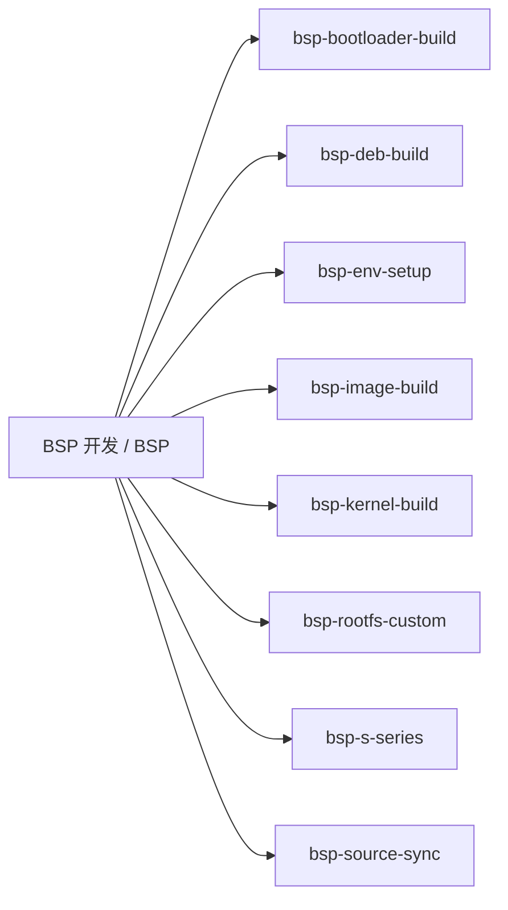
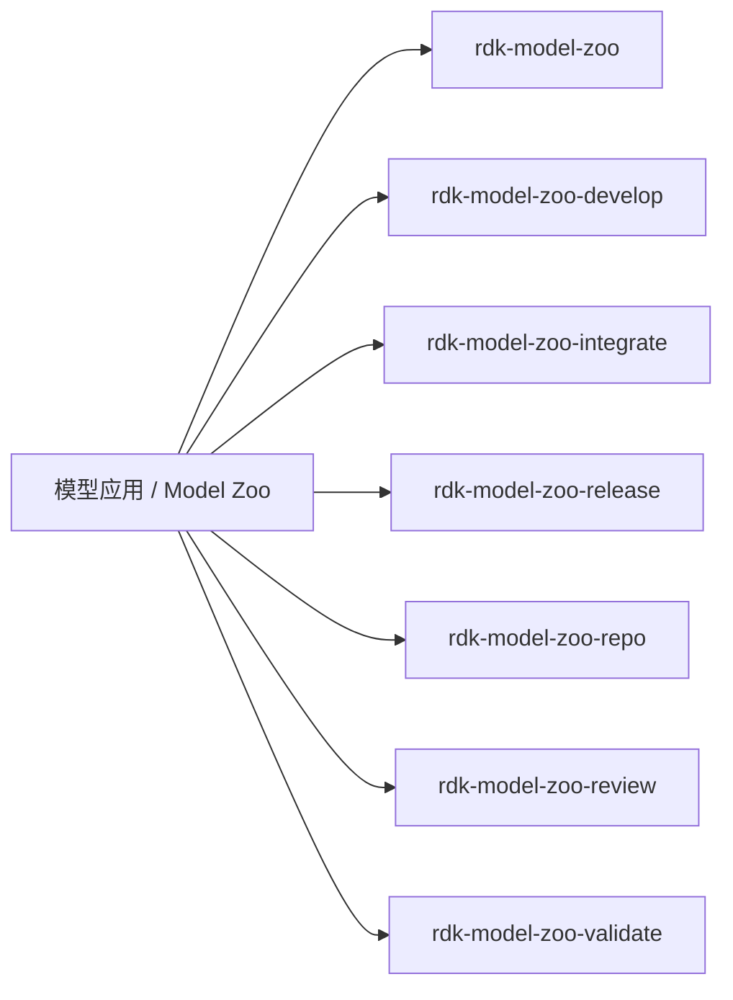
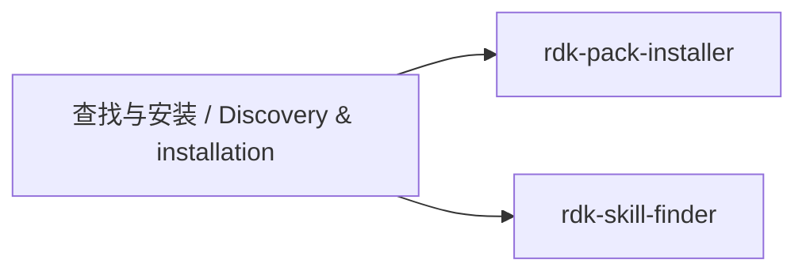

# 全量 Skill 导航 / Complete Skill Map

从任务领域找到 Skill。图中每个 Skill 节点均链接到本地 `SKILL.md`；图下同时提供 Markdown 链接，供不支持 Mermaid 点击的阅读器使用。节点名称使用目录名，便于与仓库路径对应。

Find a skill by task area. Every skill node links to its `SKILL.md`; the links below each diagram also work without Mermaid support. Labels use directory names to match repository paths.

[中文首页](../README_cn.md) · [English README](../README.md)

本图依据当前提交的 Skill 索引生成，共 **97** 个 Skill。新增或移除 Skill 时需同步更新本页。

Generated from the committed skill index: **97** skills. Refresh this page when catalog entries change.

## 设备使用 / Device · 25

**按需安装 / Select skills:** 可通过技能安装入口选择需要的 Skill。 / Select the skills needed for your task.

```mermaid
flowchart LR
    root["设备使用 / Device"]
    root --> skill0["rdk-accessories"]
    click skill0 "../skills/rdk-accessories/SKILL.md" "Open SKILL.md"
    root --> skill1["rdk-board-delegate"]
    click skill1 "../skills/rdk-board-delegate/SKILL.md" "Open SKILL.md"
    root --> skill2["rdk-board-knowledge"]
    click skill2 "../skills/rdk-board-knowledge/SKILL.md" "Open SKILL.md"
    root --> skill3["rdk-camera-setup"]
    click skill3 "../skills/rdk-camera-setup/SKILL.md" "Open SKILL.md"
    root --> skill4["rdk-command-manual"]
    click skill4 "../skills/rdk-command-manual/SKILL.md" "Open SKILL.md"
    root --> skill5["rdk-diagnostic"]
    click skill5 "../skills/rdk-diagnostic/SKILL.md" "Open SKILL.md"
    root --> skill6["rdk-docs-reference"]
    click skill6 "../skills/rdk-docs-reference/SKILL.md" "Open SKILL.md"
    root --> skill7["rdk-ecosystem"]
    click skill7 "../skills/rdk-ecosystem/SKILL.md" "Open SKILL.md"
    root --> skill8["rdk-embodied-lerobot"]
    click skill8 "../skills/rdk-embodied-lerobot/SKILL.md" "Open SKILL.md"
    root --> skill9["rdk-gpio-40pin"]
    click skill9 "../skills/rdk-gpio-40pin/SKILL.md" "Open SKILL.md"
    root --> skill10["rdk-hardware"]
    click skill10 "../skills/rdk-hardware/SKILL.md" "Open SKILL.md"
    root --> skill11["rdk-headless-mode"]
    click skill11 "../skills/rdk-headless-mode/SKILL.md" "Open SKILL.md"
    root --> skill12["rdk-llm-deployment"]
    click skill12 "../skills/rdk-llm-deployment/SKILL.md" "Open SKILL.md"
    root --> skill13["rdk-log-forensics"]
    click skill13 "../skills/rdk-log-forensics/SKILL.md" "Open SKILL.md"
    root --> skill14["rdk-memory-audit"]
    click skill14 "../skills/rdk-memory-audit/SKILL.md" "Open SKILL.md"
    root --> skill15["rdk-model-benchmark"]
    click skill15 "../skills/rdk-model-benchmark/SKILL.md" "Open SKILL.md"
    root --> skill16["rdk-model-deploy"]
    click skill16 "../skills/rdk-model-deploy/SKILL.md" "Open SKILL.md"
    root --> skill17["rdk-multimedia"]
    click skill17 "../skills/rdk-multimedia/SKILL.md" "Open SKILL.md"
    root --> skill18["rdk-network-remote"]
    click skill18 "../skills/rdk-network-remote/SKILL.md" "Open SKILL.md"
    root --> skill19["rdk-peripheral-cookbook"]
    click skill19 "../skills/rdk-peripheral-cookbook/SKILL.md" "Open SKILL.md"
    root --> skill20["rdk-source-map"]
    click skill20 "../skills/rdk-source-map/SKILL.md" "Open SKILL.md"
    root --> skill21["rdk-system-config"]
    click skill21 "../skills/rdk-system-config/SKILL.md" "Open SKILL.md"
    root --> skill22["rdk-system-maintain"]
    click skill22 "../skills/rdk-system-maintain/SKILL.md" "Open SKILL.md"
    root --> skill23["rdk-tros-setup"]
    click skill23 "../skills/rdk-tros-setup/SKILL.md" "Open SKILL.md"
    root --> skill24["rdk-vision-pipeline"]
    click skill24 "../skills/rdk-vision-pipeline/SKILL.md" "Open SKILL.md"
```

[rdk-accessories](../skills/rdk-accessories/SKILL.md) · [rdk-board-delegate](../skills/rdk-board-delegate/SKILL.md) · [rdk-board-knowledge](../skills/rdk-board-knowledge/SKILL.md) · [rdk-camera-setup](../skills/rdk-camera-setup/SKILL.md) · [rdk-command-manual](../skills/rdk-command-manual/SKILL.md) · [rdk-diagnostic](../skills/rdk-diagnostic/SKILL.md) · [rdk-docs-reference](../skills/rdk-docs-reference/SKILL.md) · [rdk-ecosystem](../skills/rdk-ecosystem/SKILL.md) · [rdk-embodied-lerobot](../skills/rdk-embodied-lerobot/SKILL.md) · [rdk-gpio-40pin](../skills/rdk-gpio-40pin/SKILL.md) · [rdk-hardware](../skills/rdk-hardware/SKILL.md) · [rdk-headless-mode](../skills/rdk-headless-mode/SKILL.md) · [rdk-llm-deployment](../skills/rdk-llm-deployment/SKILL.md) · [rdk-log-forensics](../skills/rdk-log-forensics/SKILL.md) · [rdk-memory-audit](../skills/rdk-memory-audit/SKILL.md) · [rdk-model-benchmark](../skills/rdk-model-benchmark/SKILL.md) · [rdk-model-deploy](../skills/rdk-model-deploy/SKILL.md) · [rdk-multimedia](../skills/rdk-multimedia/SKILL.md) · [rdk-network-remote](../skills/rdk-network-remote/SKILL.md) · [rdk-peripheral-cookbook](../skills/rdk-peripheral-cookbook/SKILL.md) · [rdk-source-map](../skills/rdk-source-map/SKILL.md) · [rdk-system-config](../skills/rdk-system-config/SKILL.md) · [rdk-system-maintain](../skills/rdk-system-maintain/SKILL.md) · [rdk-tros-setup](../skills/rdk-tros-setup/SKILL.md) · [rdk-vision-pipeline](../skills/rdk-vision-pipeline/SKILL.md)

## BSP 开发 / BSP · 8

**按需安装 / Select skills:** 可通过技能安装入口选择需要的 Skill。 / Select the skills needed for your task.

[bsp-bootloader-build](../skills/bsp-bootloader-build/SKILL.md) · [bsp-deb-build](../skills/bsp-deb-build/SKILL.md) · [bsp-env-setup](../skills/bsp-env-setup/SKILL.md) · [bsp-image-build](../skills/bsp-image-build/SKILL.md) · [bsp-kernel-build](../skills/bsp-kernel-build/SKILL.md) · [bsp-rootfs-custom](../skills/bsp-rootfs-custom/SKILL.md) · [bsp-s-series](../skills/bsp-s-series/SKILL.md) · [bsp-source-sync](../skills/bsp-source-sync/SKILL.md)

## X5 模型工具链 / X5 toolchain · 22

**整包安装 / Whole-pack setup:** 内部技能共享项目资源，请安装整个 Pack。 / These skills share project resources and require the complete pack.

```mermaid
flowchart LR
    root["X5 模型工具链 / X5 toolchain"]
    root --> skill33["x5-accuracy-diagnostics"]
    click skill33 "../skills/oe-skills-x5/skills/x5-accuracy-diagnostics/SKILL.md" "Open SKILL.md"
    root --> skill34["x5-board-monitor"]
    click skill34 "../skills/oe-skills-x5/skills/x5-board-monitor/SKILL.md" "Open SKILL.md"
    root --> skill35["x5-bpu-python-api"]
    click skill35 "../skills/oe-skills-x5/skills/x5-bpu-python-api/SKILL.md" "Open SKILL.md"
    root --> skill36["x5-calibration-data-prepare"]
    click skill36 "../skills/oe-skills-x5/skills/x5-calibration-data-prepare/SKILL.md" "Open SKILL.md"
    root --> skill37["x5-consistency-diagnostics"]
    click skill37 "../skills/oe-skills-x5/skills/x5-consistency-diagnostics/SKILL.md" "Open SKILL.md"
    root --> skill38["x5-environment-install"]
    click skill38 "../skills/oe-skills-x5/skills/x5-environment-install/SKILL.md" "Open SKILL.md"
    root --> skill39["x5-environment-probe"]
    click skill39 "../skills/oe-skills-x5/skills/x5-environment-probe/SKILL.md" "Open SKILL.md"
    root --> skill40["x5-environment-setup"]
    click skill40 "../skills/oe-skills-x5/skills/x5-environment-setup/SKILL.md" "Open SKILL.md"
    root --> skill41["x5-model-diagnostics"]
    click skill41 "../skills/oe-skills-x5/skills/x5-model-diagnostics/SKILL.md" "Open SKILL.md"
    root --> skill42["x5-model-preflight"]
    click skill42 "../skills/oe-skills-x5/skills/x5-model-preflight/SKILL.md" "Open SKILL.md"
    root --> skill43["x5-performance-diagnostics"]
    click skill43 "../skills/oe-skills-x5/skills/x5-performance-diagnostics/SKILL.md" "Open SKILL.md"
    root --> skill44["x5-ptq-compile"]
    click skill44 "../skills/oe-skills-x5/skills/x5-ptq-compile/SKILL.md" "Open SKILL.md"
    root --> skill45["x5-ptq-config-authoring"]
    click skill45 "../skills/oe-skills-x5/skills/x5-ptq-config-authoring/SKILL.md" "Open SKILL.md"
    root --> skill46["x5-ptq-deploy"]
    click skill46 "../skills/oe-skills-x5/skills/x5-ptq-deploy/SKILL.md" "Open SKILL.md"
    root --> skill47["x5-qat-adaptation"]
    click skill47 "../skills/oe-skills-x5/skills/x5-qat-adaptation/SKILL.md" "Open SKILL.md"
    root --> skill48["x5-qat-compile"]
    click skill48 "../skills/oe-skills-x5/skills/x5-qat-compile/SKILL.md" "Open SKILL.md"
    root --> skill49["x5-qat-deploy"]
    click skill49 "../skills/oe-skills-x5/skills/x5-qat-deploy/SKILL.md" "Open SKILL.md"
    root --> skill50["x5-qat-training"]
    click skill50 "../skills/oe-skills-x5/skills/x5-qat-training/SKILL.md" "Open SKILL.md"
    root --> skill51["x5-router"]
    click skill51 "../skills/oe-skills-x5/skills/x5-router/SKILL.md" "Open SKILL.md"
    root --> skill52["x5-runtime-cpp-infer"]
    click skill52 "../skills/oe-skills-x5/skills/x5-runtime-cpp-infer/SKILL.md" "Open SKILL.md"
    root --> skill53["x5-runtime-deploy"]
    click skill53 "../skills/oe-skills-x5/skills/x5-runtime-deploy/SKILL.md" "Open SKILL.md"
    root --> skill54["x5-runtime-perf-eval"]
    click skill54 "../skills/oe-skills-x5/skills/x5-runtime-perf-eval/SKILL.md" "Open SKILL.md"
```

[x5-accuracy-diagnostics](../skills/oe-skills-x5/skills/x5-accuracy-diagnostics/SKILL.md) · [x5-board-monitor](../skills/oe-skills-x5/skills/x5-board-monitor/SKILL.md) · [x5-bpu-python-api](../skills/oe-skills-x5/skills/x5-bpu-python-api/SKILL.md) · [x5-calibration-data-prepare](../skills/oe-skills-x5/skills/x5-calibration-data-prepare/SKILL.md) · [x5-consistency-diagnostics](../skills/oe-skills-x5/skills/x5-consistency-diagnostics/SKILL.md) · [x5-environment-install](../skills/oe-skills-x5/skills/x5-environment-install/SKILL.md) · [x5-environment-probe](../skills/oe-skills-x5/skills/x5-environment-probe/SKILL.md) · [x5-environment-setup](../skills/oe-skills-x5/skills/x5-environment-setup/SKILL.md) · [x5-model-diagnostics](../skills/oe-skills-x5/skills/x5-model-diagnostics/SKILL.md) · [x5-model-preflight](../skills/oe-skills-x5/skills/x5-model-preflight/SKILL.md) · [x5-performance-diagnostics](../skills/oe-skills-x5/skills/x5-performance-diagnostics/SKILL.md) · [x5-ptq-compile](../skills/oe-skills-x5/skills/x5-ptq-compile/SKILL.md) · [x5-ptq-config-authoring](../skills/oe-skills-x5/skills/x5-ptq-config-authoring/SKILL.md) · [x5-ptq-deploy](../skills/oe-skills-x5/skills/x5-ptq-deploy/SKILL.md) · [x5-qat-adaptation](../skills/oe-skills-x5/skills/x5-qat-adaptation/SKILL.md) · [x5-qat-compile](../skills/oe-skills-x5/skills/x5-qat-compile/SKILL.md) · [x5-qat-deploy](../skills/oe-skills-x5/skills/x5-qat-deploy/SKILL.md) · [x5-qat-training](../skills/oe-skills-x5/skills/x5-qat-training/SKILL.md) · [x5-router](../skills/oe-skills-x5/skills/x5-router/SKILL.md) · [x5-runtime-cpp-infer](../skills/oe-skills-x5/skills/x5-runtime-cpp-infer/SKILL.md) · [x5-runtime-deploy](../skills/oe-skills-x5/skills/x5-runtime-deploy/SKILL.md) · [x5-runtime-perf-eval](../skills/oe-skills-x5/skills/x5-runtime-perf-eval/SKILL.md)

## S 系列模型工具链 / S toolchain · 33

**整包安装 / Whole-pack setup:** 内部技能共享项目资源，请安装整个 Pack。 / These skills share project resources and require the complete pack.

```mermaid
flowchart LR
    root["S 系列模型工具链 / S toolchain"]
    root --> skill55["hbdk-manual"]
    click skill55 "../skills/oe-skills-s/skills/hbdk/hbdk-manual/SKILL.md" "Open SKILL.md"
    root --> skill56["j6-hbdk-compile"]
    click skill56 "../skills/oe-skills-s/skills/hbdk/j6-hbdk-compile/SKILL.md" "Open SKILL.md"
    root --> skill57["hmct"]
    click skill57 "../skills/oe-skills-s/skills/hmct/SKILL.md" "Open SKILL.md"
    root --> skill58["j6-hmct-cosine-similarity-tuning"]
    click skill58 "../skills/oe-skills-s/skills/hmct/j6-hmct-cosine-similarity-tuning/SKILL.md" "Open SKILL.md"
    root --> skill59["hb-analyzer-performance"]
    click skill59 "../skills/oe-skills-s/skills/horizon_tc_ui/hb-analyzer-performance/SKILL.md" "Open SKILL.md"
    root --> skill60["horizon-tc-ui"]
    click skill60 "../skills/oe-skills-s/skills/horizon_tc_ui/horizon-tc-ui/SKILL.md" "Open SKILL.md"
    root --> skill61["horizon-router"]
    click skill61 "../skills/oe-skills-s/skills/horizon-router/SKILL.md" "Open SKILL.md"
    root --> skill62["board-detection"]
    click skill62 "../skills/oe-skills-s/skills/horizon-router/board-detection/SKILL.md" "Open SKILL.md"
    root --> skill63["oe-llm-package-detection"]
    click skill63 "../skills/oe-skills-s/skills/horizon-router/oe-llm-package-detection/SKILL.md" "Open SKILL.md"
    root --> skill64["oe-llm-package-install"]
    click skill64 "../skills/oe-skills-s/skills/horizon-router/oe-llm-package-install/SKILL.md" "Open SKILL.md"
    root --> skill65["oe-package-detection"]
    click skill65 "../skills/oe-skills-s/skills/horizon-router/oe-package-detection/SKILL.md" "Open SKILL.md"
    root --> skill66["oe-package-install"]
    click skill66 "../skills/oe-skills-s/skills/horizon-router/oe-package-install/SKILL.md" "Open SKILL.md"
    root --> skill67["j6-plugin-adaptation"]
    click skill67 "../skills/oe-skills-s/skills/plugin/j6-plugin-adaptation/SKILL.md" "Open SKILL.md"
    root --> skill68["j6-plugin-dynamic-block"]
    click skill68 "../skills/oe-skills-s/skills/plugin/j6-plugin-adaptation/j6-plugin-dynamic-block/SKILL.md" "Open SKILL.md"
    root --> skill69["j6-plugin-insert-quant-dequant"]
    click skill69 "../skills/oe-skills-s/skills/plugin/j6-plugin-adaptation/j6-plugin-insert-quant-dequant/SKILL.md" "Open SKILL.md"
    root --> skill70["j6-plugin-prepare"]
    click skill70 "../skills/oe-skills-s/skills/plugin/j6-plugin-adaptation/j6-plugin-prepare/SKILL.md" "Open SKILL.md"
    root --> skill71["j6-plugin-set-fake-quantize"]
    click skill71 "../skills/oe-skills-s/skills/plugin/j6-plugin-adaptation/j6-plugin-set-fake-quantize/SKILL.md" "Open SKILL.md"
    root --> skill72["j6-plugin-set-march"]
    click skill72 "../skills/oe-skills-s/skills/plugin/j6-plugin-adaptation/j6-plugin-set-march/SKILL.md" "Open SKILL.md"
    root --> skill73["j6-plugin-consistency-debug"]
    click skill73 "../skills/oe-skills-s/skills/plugin/j6-plugin-consistency-debug/SKILL.md" "Open SKILL.md"
    root --> skill74["j6-plugin-export"]
    click skill74 "../skills/oe-skills-s/skills/plugin/j6-plugin-export/SKILL.md" "Open SKILL.md"
    root --> skill75["j6-plugin-graph-diff"]
    click skill75 "../skills/oe-skills-s/skills/plugin/j6-plugin-graph-diff/SKILL.md" "Open SKILL.md"
    root --> skill76["j6-plugin-hbdk-generating"]
    click skill76 "../skills/oe-skills-s/skills/plugin/j6-plugin-hbdk-generating/SKILL.md" "Open SKILL.md"
    root --> skill77["j6-hbdk-export-compile"]
    click skill77 "../skills/oe-skills-s/skills/plugin/j6-plugin-hbdk-generating/j6-hbdk-export-compile/SKILL.md" "Open SKILL.md"
    root --> skill78["j6-plugin-quantization"]
    click skill78 "../skills/oe-skills-s/skills/plugin/j6-plugin-hbdk-generating/j6-plugin-quantization/SKILL.md" "Open SKILL.md"
    root --> skill79["j6-plugin-model-check-result"]
    click skill79 "../skills/oe-skills-s/skills/plugin/j6-plugin-model-check-result/SKILL.md" "Open SKILL.md"
    root --> skill80["j6-plugin-precision-tuning"]
    click skill80 "../skills/oe-skills-s/skills/plugin/j6-plugin-precision-tuning/SKILL.md" "Open SKILL.md"
    root --> skill81["ucp"]
    click skill81 "../skills/oe-skills-s/skills/ucp/SKILL.md" "Open SKILL.md"
    root --> skill82["j6-board-monitor"]
    click skill82 "../skills/oe-skills-s/skills/ucp/j6-board-monitor/SKILL.md" "Open SKILL.md"
    root --> skill83["j6-ucp-hbm-infer"]
    click skill83 "../skills/oe-skills-s/skills/ucp/j6-ucp-hbm-infer/SKILL.md" "Open SKILL.md"
    root --> skill84["j6-ucp-infer-generating"]
    click skill84 "../skills/oe-skills-s/skills/ucp/j6-ucp-infer-generating/SKILL.md" "Open SKILL.md"
    root --> skill85["j6-ucp-model-perf-eval"]
    click skill85 "../skills/oe-skills-s/skills/ucp/j6-ucp-model-perf-eval/SKILL.md" "Open SKILL.md"
    root --> skill86["j6-ucp-perfetto-trace-analysis"]
    click skill86 "../skills/oe-skills-s/skills/ucp/j6-ucp-perfetto-trace-analysis/SKILL.md" "Open SKILL.md"
    root --> skill87["j6-ucp-perfetto-trace-catcher"]
    click skill87 "../skills/oe-skills-s/skills/ucp/j6-ucp-perfetto-trace-catcher/SKILL.md" "Open SKILL.md"
```

[hbdk-manual](../skills/oe-skills-s/skills/hbdk/hbdk-manual/SKILL.md) · [j6-hbdk-compile](../skills/oe-skills-s/skills/hbdk/j6-hbdk-compile/SKILL.md) · [hmct](../skills/oe-skills-s/skills/hmct/SKILL.md) · [j6-hmct-cosine-similarity-tuning](../skills/oe-skills-s/skills/hmct/j6-hmct-cosine-similarity-tuning/SKILL.md) · [hb-analyzer-performance](../skills/oe-skills-s/skills/horizon_tc_ui/hb-analyzer-performance/SKILL.md) · [horizon-tc-ui](../skills/oe-skills-s/skills/horizon_tc_ui/horizon-tc-ui/SKILL.md) · [horizon-router](../skills/oe-skills-s/skills/horizon-router/SKILL.md) · [board-detection](../skills/oe-skills-s/skills/horizon-router/board-detection/SKILL.md) · [oe-llm-package-detection](../skills/oe-skills-s/skills/horizon-router/oe-llm-package-detection/SKILL.md) · [oe-llm-package-install](../skills/oe-skills-s/skills/horizon-router/oe-llm-package-install/SKILL.md) · [oe-package-detection](../skills/oe-skills-s/skills/horizon-router/oe-package-detection/SKILL.md) · [oe-package-install](../skills/oe-skills-s/skills/horizon-router/oe-package-install/SKILL.md) · [j6-plugin-adaptation](../skills/oe-skills-s/skills/plugin/j6-plugin-adaptation/SKILL.md) · [j6-plugin-dynamic-block](../skills/oe-skills-s/skills/plugin/j6-plugin-adaptation/j6-plugin-dynamic-block/SKILL.md) · [j6-plugin-insert-quant-dequant](../skills/oe-skills-s/skills/plugin/j6-plugin-adaptation/j6-plugin-insert-quant-dequant/SKILL.md) · [j6-plugin-prepare](../skills/oe-skills-s/skills/plugin/j6-plugin-adaptation/j6-plugin-prepare/SKILL.md) · [j6-plugin-set-fake-quantize](../skills/oe-skills-s/skills/plugin/j6-plugin-adaptation/j6-plugin-set-fake-quantize/SKILL.md) · [j6-plugin-set-march](../skills/oe-skills-s/skills/plugin/j6-plugin-adaptation/j6-plugin-set-march/SKILL.md) · [j6-plugin-consistency-debug](../skills/oe-skills-s/skills/plugin/j6-plugin-consistency-debug/SKILL.md) · [j6-plugin-export](../skills/oe-skills-s/skills/plugin/j6-plugin-export/SKILL.md) · [j6-plugin-graph-diff](../skills/oe-skills-s/skills/plugin/j6-plugin-graph-diff/SKILL.md) · [j6-plugin-hbdk-generating](../skills/oe-skills-s/skills/plugin/j6-plugin-hbdk-generating/SKILL.md) · [j6-hbdk-export-compile](../skills/oe-skills-s/skills/plugin/j6-plugin-hbdk-generating/j6-hbdk-export-compile/SKILL.md) · [j6-plugin-quantization](../skills/oe-skills-s/skills/plugin/j6-plugin-hbdk-generating/j6-plugin-quantization/SKILL.md) · [j6-plugin-model-check-result](../skills/oe-skills-s/skills/plugin/j6-plugin-model-check-result/SKILL.md) · [j6-plugin-precision-tuning](../skills/oe-skills-s/skills/plugin/j6-plugin-precision-tuning/SKILL.md) · [ucp](../skills/oe-skills-s/skills/ucp/SKILL.md) · [j6-board-monitor](../skills/oe-skills-s/skills/ucp/j6-board-monitor/SKILL.md) · [j6-ucp-hbm-infer](../skills/oe-skills-s/skills/ucp/j6-ucp-hbm-infer/SKILL.md) · [j6-ucp-infer-generating](../skills/oe-skills-s/skills/ucp/j6-ucp-infer-generating/SKILL.md) · [j6-ucp-model-perf-eval](../skills/oe-skills-s/skills/ucp/j6-ucp-model-perf-eval/SKILL.md) · [j6-ucp-perfetto-trace-analysis](../skills/oe-skills-s/skills/ucp/j6-ucp-perfetto-trace-analysis/SKILL.md) · [j6-ucp-perfetto-trace-catcher](../skills/oe-skills-s/skills/ucp/j6-ucp-perfetto-trace-catcher/SKILL.md)

## 模型应用 / Model Zoo · 7

**按需安装 / Select skills:** 可通过技能安装入口选择需要的 Skill。 / Select the skills needed for your task.

[rdk-model-zoo](../skills/rdk-model-zoo/SKILL.md) · [rdk-model-zoo-develop](../skills/rdk-model-zoo-develop/SKILL.md) · [rdk-model-zoo-integrate](../skills/rdk-model-zoo-integrate/SKILL.md) · [rdk-model-zoo-release](../skills/rdk-model-zoo-release/SKILL.md) · [rdk-model-zoo-repo](../skills/rdk-model-zoo-repo/SKILL.md) · [rdk-model-zoo-review](../skills/rdk-model-zoo-review/SKILL.md) · [rdk-model-zoo-validate](../skills/rdk-model-zoo-validate/SKILL.md)

## 查找与安装 / Discovery & installation · 2

**按需安装 / Select skills:** 可通过技能安装入口选择需要的 Skill。 / Select the skills needed for your task.

[rdk-pack-installer](../skills/rdk-pack-installer/SKILL.md) · [rdk-skill-finder](../skills/rdk-skill-finder/SKILL.md)

